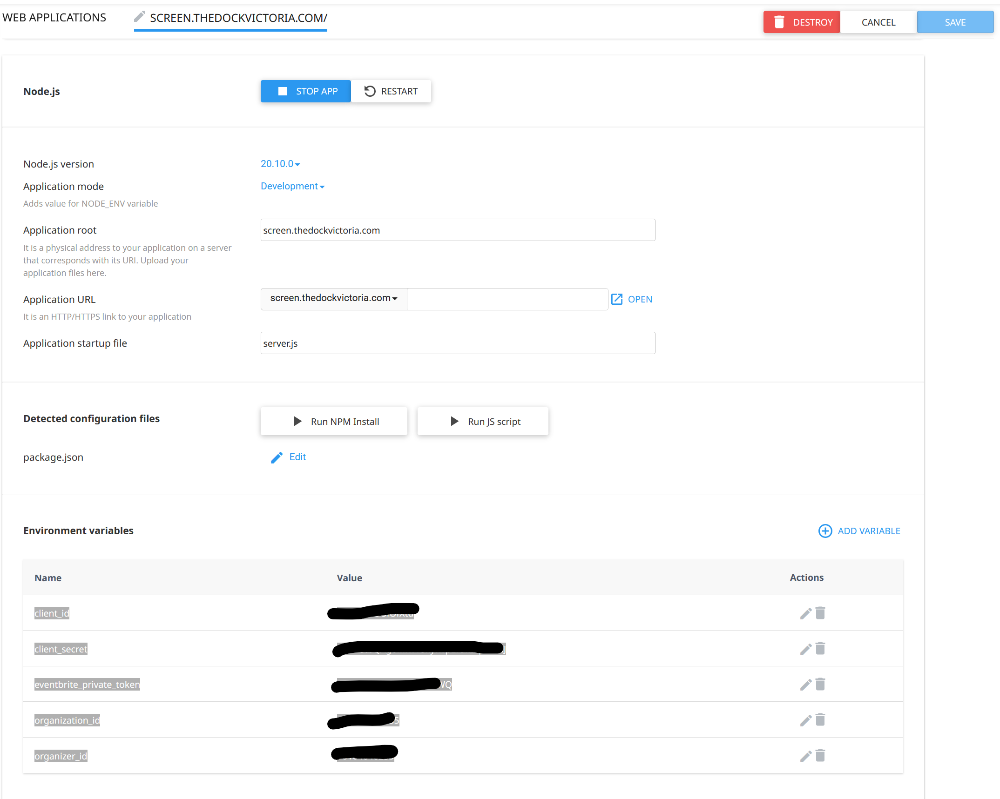

## Instructions on how to deploy theDockScreenApp

The app is currently hosted on Fullhost, a webhost that hosts various websites by Scale

In order to deploy this app from the Github repo https://github.com/DanielPopOut/dockScreen, you will need access to the Scale fullhost account.

Once you have access and can login on https://manage.fullhost.com/, deploying the app is easy

- After logging into the fullhost web UI, go to the Webhosting product FullPlus-EH-V1
- On the left hand side in 'Actions', click 'Login to cPanel'
- CPanel will open in a new tab
- In the 'Tools' section, click on 'Git Version Control' in the 'Files' section
- Click on 'Manage' for the dockScreen repository. 
- Click on the 'Pull or Deploy' tab
- Click on 'Update from Remote'

That's it - the current version of the **main** branch is deployed and should appear on the screen (caching might delay this somewhat)

### Troubleshooting

If the app no longer works, in cPanel under 'Software', there is a 'Set Up NodeJS App' option. Going in there allows you to stop/start or reload 
the app, change the node version etc. If all fails you can also delete the app and set it up again, however **ensure you have the environment variables
backed up!**

- The app config should look something like this:
